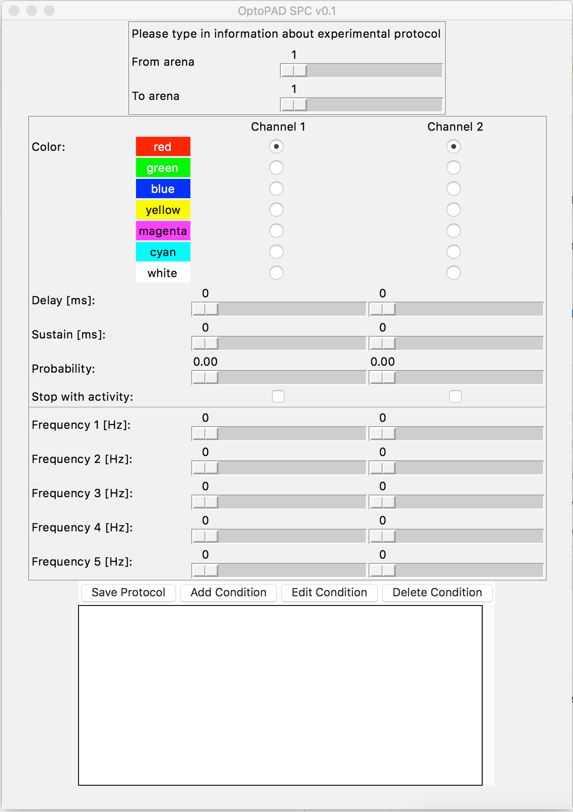

# optopad-gui
Python-/TKinter-based GUI for creating optogenetic stimulation protocols for the OptoPad setup 

## Installation

## Quickstart

## Useful information

### Column indices in data matrix
| Index         | Description   |
| ------------: |:-------------:|
| 0             | Color CH1 (int) |
| 1             | Color CH2 (int) |
| 2             | Delay CH1 (int) |
| 3             | Delay CH2 (int) |
| 4             | Sustain CH1 (int) |
| 5             | Sustain CH2 (int) |
| 6             | Probability CH1 (float) |
| 7             | Probability CH2 (float) |
| 8             | Stop condition (int) |
| 9             | Stop condition (int) |
| 10            | Frequency 1 CH1 (int) |
| 11            | Frequency 2 CH1 (int) |
| 12            | Frequency 3 CH1 (int) |
| 13            | Frequency 4 CH1 (int) |
| 14            | Frequency 5 CH1 (int) |
| 15            | Frequency 1 CH2 (int) |
| 16            | Frequency 2 CH2 (int) |
| 17            | Frequency 3 CH2 (int) |
| 18            | Frequency 4 CH2 (int) |
| 19            | Frequency 5 CH2 (int) |
